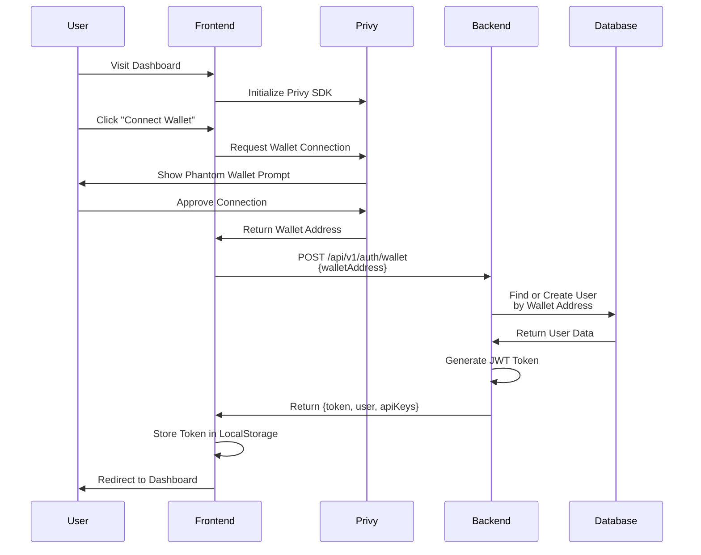
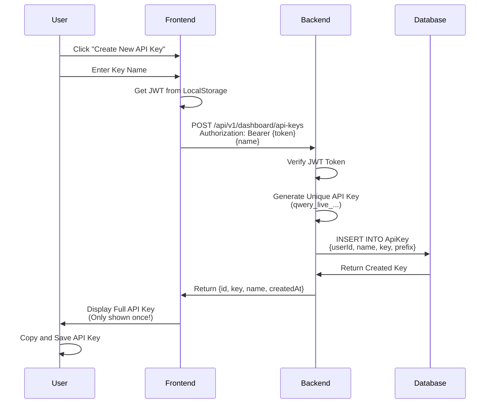
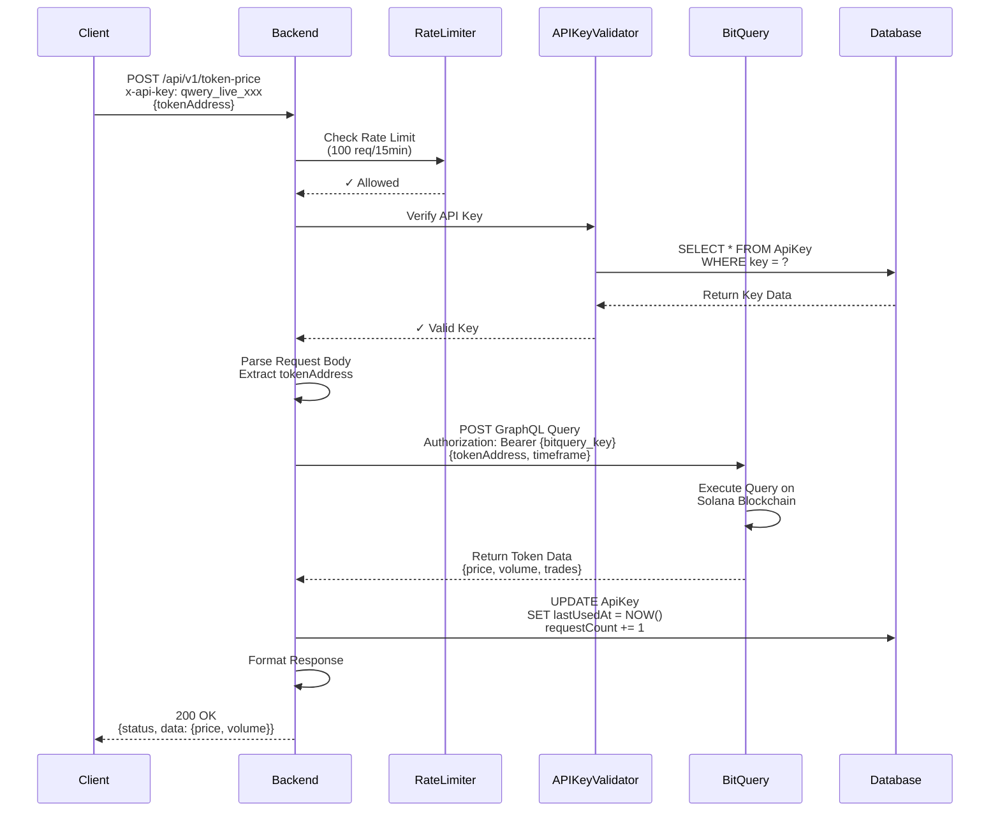
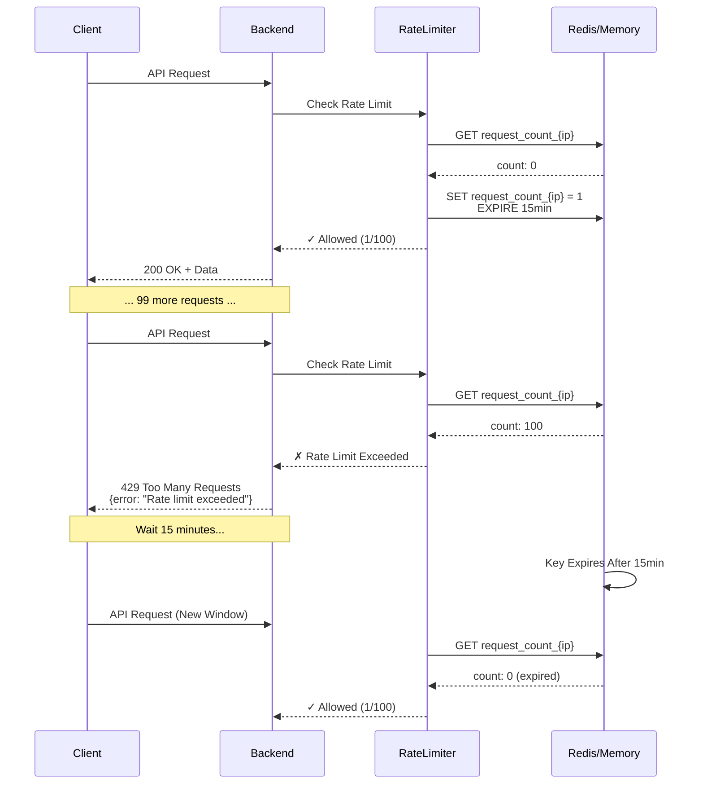
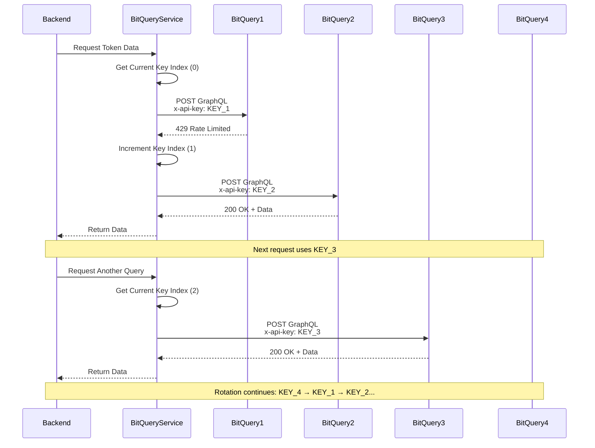
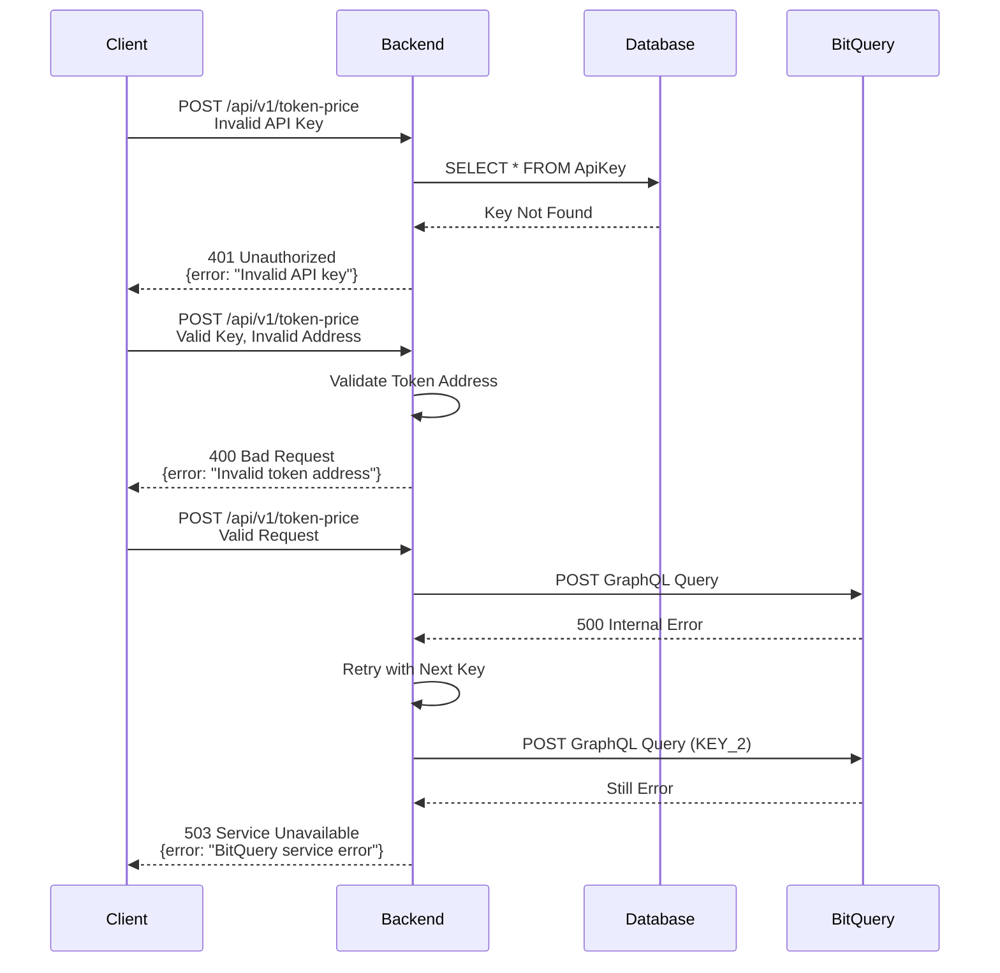
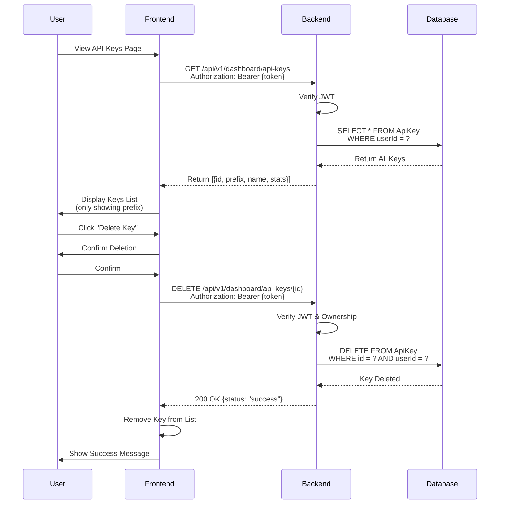
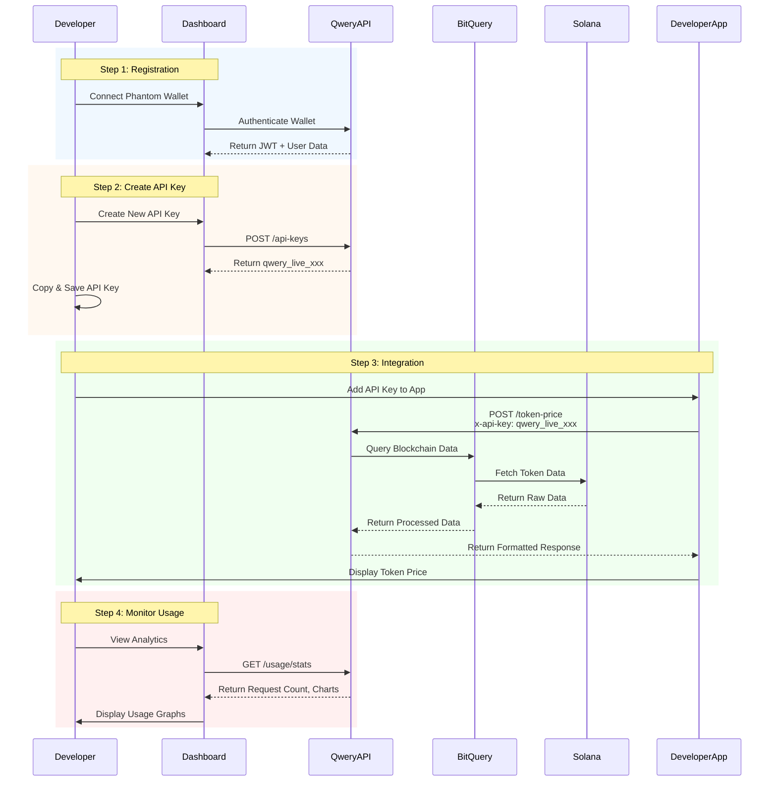
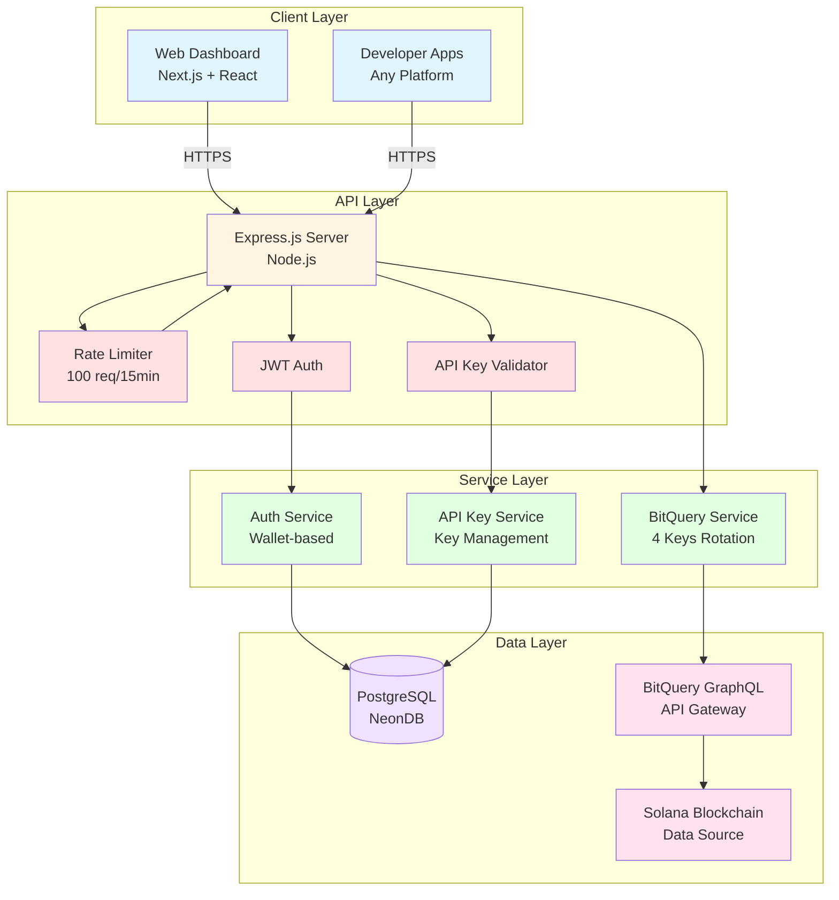

# Qwery API - Sequence Diagrams

## 1. User Authentication Flow (Wallet-Based)

## 2. API Key Creation Flow

## 3. API Request Flow (Token Price Example)

## 4. Rate Limiting Flow

## 5. Multi-Key BitQuery Rotation Flow

## 6. Error Handling Flow

## 7. Dashboard API Keys Management Flow

## 8. Complete End-to-End Flow

## Architecture Overview

---

## How to Use These Diagrams in README

Copy and paste any of the above Mermaid code blocks into your README.md file. GitHub automatically renders Mermaid diagrams!

Example:
\`\`\`mermaid
[paste the diagram code here]
\`\`\`

### Key Components Explained:

1. **Authentication**: Wallet-based using Privy + JWT
2. **API Keys**: Unique keys with prefix `qwery_live_`
3. **Rate Limiting**: 100 requests per 15 minutes per IP
4. **BitQuery Rotation**: 4 API keys rotating to maximize throughput
5. **Database**: PostgreSQL storing users, API keys, and usage stats
6. **Security**: JWT tokens, API key validation, CORS protection

### Request Flow Summary:
1. Client sends request with `x-api-key` header
2. Backend validates key and checks rate limits
3. Query sent to BitQuery GraphQL API
4. BitQuery fetches data from Solana blockchain
5. Response formatted and returned to client
6. Usage stats updated in database
